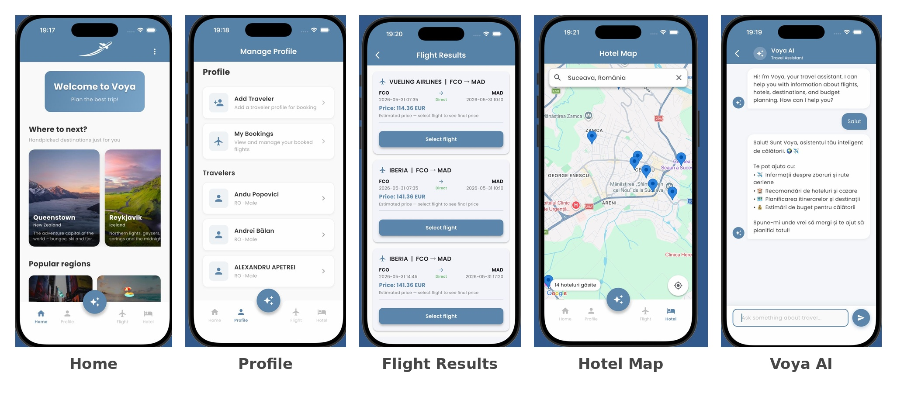
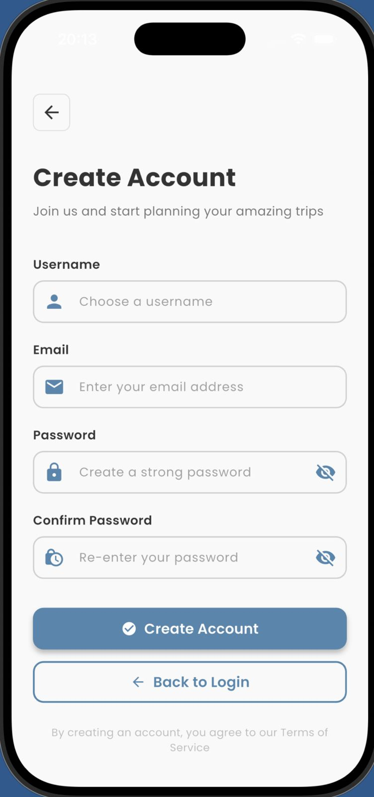
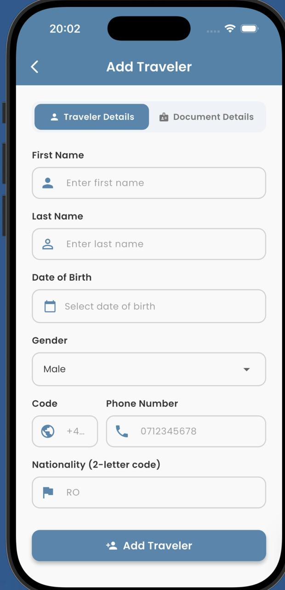
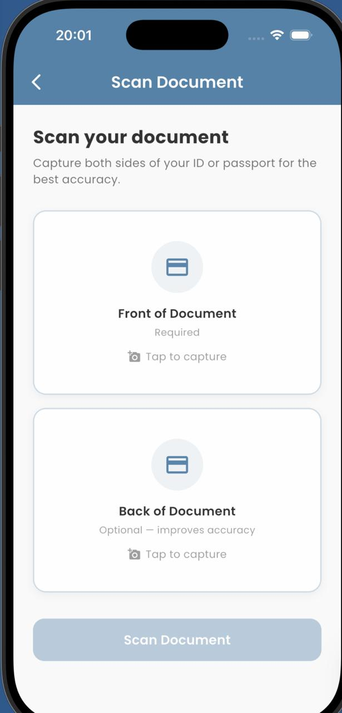
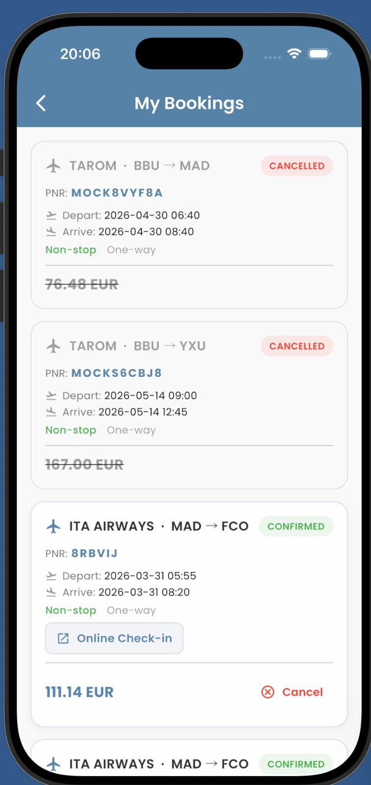
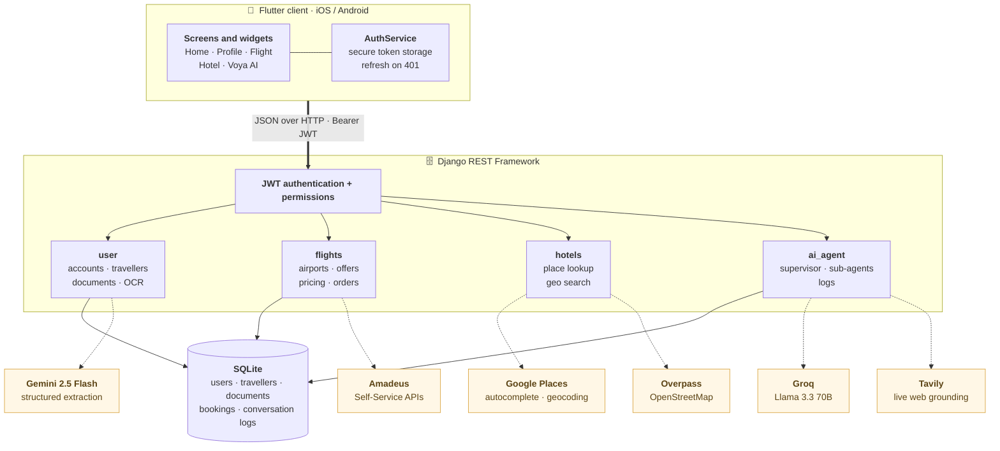
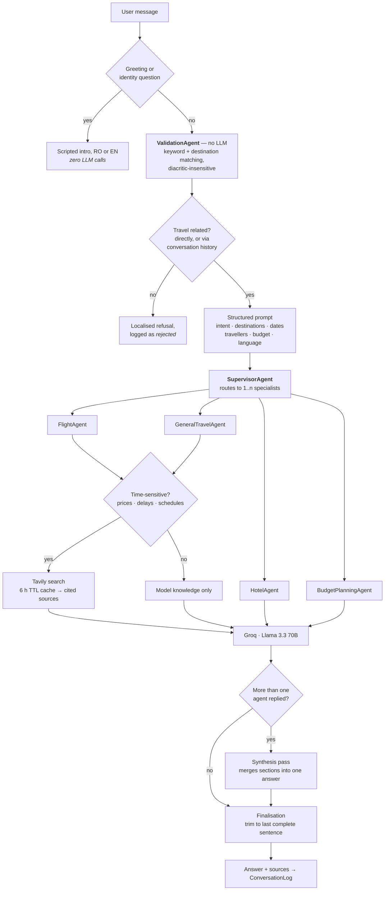
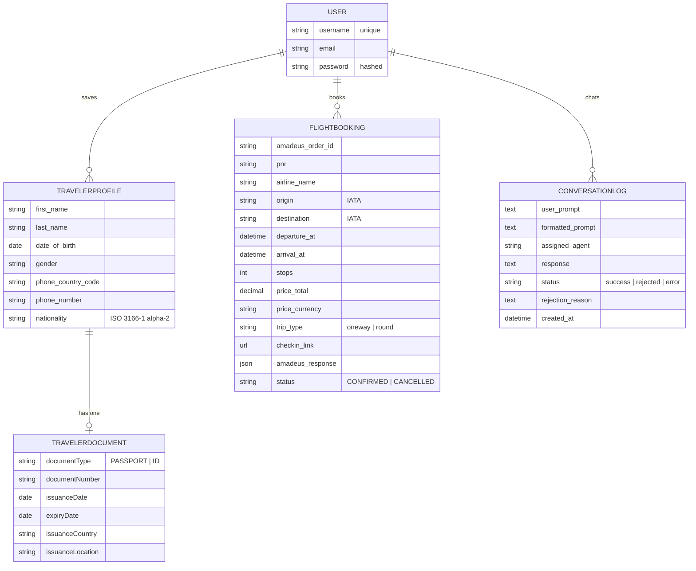

<div align="center">


### Plan the whole trip in one place

Flights, stays, traveller profiles, ID documents and a travel assistant that
actually knows what you asked three messages ago.

<p>
  
  
  
  
  
  
  
</p>



</div>

---

## Contents

- [What Voya is](#what-voya-is)
- [Highlights](#highlights)
- [Features](#features)
- [Screenshots](#screenshots)
- [Architecture](#architecture)
- [The Voya AI agent system](#the-voya-ai-agent-system)
- [Tech stack](#tech-stack)
- [Getting started](#getting-started)
- [Environment variables](#environment-variables)
- [API reference](#api-reference)
- [Data model](#data-model)
- [Testing](#testing)
- [Engineering notes](#engineering-notes)
- [Project structure](#project-structure)
- [Roadmap](#roadmap)
- [License](#license)

---

## What Voya is

Booking a trip is rarely one task. You compare flights on one site, look for a
hotel on another, dig your passport out of a drawer to type the same dozen fields
into a form you already filled in last summer, and then open a fourth tab to ask
whether three days is enough for Lisbon.

Voya is a full-stack mobile app that puts those steps behind one login. You save
each traveller once — including their ID or passport, scanned rather than typed —
then reuse that data every time you search a flight, explore a neighbourhood on
the map, or ask the built-in assistant where to go.

The app is Flutter; the server is Django REST Framework and owns every
third-party integration, so the credentials for Amadeus, Google, Gemini and Groq
live on the server and never inside the mobile binary.

> **Scope note.** Flights run against the **Amadeus Self-Service sandbox**. Offers,
> pricing confirmations, orders and PNRs are genuine API round-trips, but they are
> test-environment records — no ticket is ever purchased and no card is ever
> charged. Everything else (auth, profiles, OCR, map search, the assistant) runs
> against production services.

---

## Highlights

The parts of this project I would point at in a code review:

- **A multi-agent assistant, not a chatbot wrapper.** A deterministic validator
  filters and structures the request *before* any token is spent; a supervisor
  then fans the query out to one or more specialist agents and synthesises a
  single answer. Off-topic messages cost zero LLM calls.
- **Grounding only when grounding is needed.** Questions about prices, delays,
  schedules or a specific year trigger a live web search whose results are fed to
  the model as cited context. Everything else answers from model knowledge — and
  when the search fails, the agent is explicitly told to say it could not verify
  live rather than invent a number.
- **Answers that never end mid-sentence.** Token limits truncate models; a
  finalisation pass trims every response back to its last complete sentence, or
  falls back to a clean message.
- **Documents read, not typed.** A photo of an ID or passport goes to Gemini
  under a strict response schema at `temperature=0`, and the extracted fields
  pre-fill the traveller form — with alpha-3 country codes normalised to the
  alpha-2 codes the airline APIs demand.
- **A map that respects its rate limits.** Haversine filtering and distance
  sorting on the server, plus an 800 m movement threshold, a debounce timer and a
  monotonic request-ID guard on the client, so panning the map does not melt the
  Overpass API or paint stale markers.
- **Bilingual by design.** Romanian and English are detected per message,
  diacritic-insensitively, and the answer is pinned to the language you wrote in —
  even when the conversation history is mixed.

---

## Features

| Feature | What it does |
|---|---|
| **Accounts & sessions** | Registration with Django's password validators, JWT login, rotating refresh tokens with blacklisting, silent refresh on `401`, guarded routes on the client. |
| **Traveller profiles** | Save a traveller once — name, date of birth, gender, phone, nationality — and reuse them across bookings. Full create / list / edit / delete, scoped to the signed-in user. |
| **Document scanning** | Photograph the front (and optionally the back) of an ID or passport; the extracted fields land pre-filled in the traveller form for review. |
| **Flight search** | IATA autocomplete for airports, one-way and round-trip search, normalised offer cards with airline name, stops, times and price. |
| **Booking flow** | Confirm the live price of a chosen offer, attach saved travellers, create the order, and get the PNR plus an airline check-in link. |
| **My Bookings** | Every order saved to the account, with status, price, route and one-tap check-in. |
| **Hotel map** | Search a place, pan the map, and see accommodation from OpenStreetMap as markers — filtered and sorted by real distance from the map centre. |
| **Voya AI** | A travel assistant backed by four specialist agents (flights, hotels, itineraries, budget), conversation memory, live web grounding and source links. |

---

## Screenshots

<div align="center">

| Create account | Add traveller | Scan document | My bookings |
|:---:|:---:|:---:|:---:|
|  |  |  |  |

</div>

---

## Architecture

Four layers: the Flutter client, a Django REST API that owns all business logic
and credentials, the database, and the external services. The client never talks
to a third party directly.



**Why the backend owns the integrations.** Every third-party key lives in the
server environment. The mobile app holds exactly one secret — the user's own JWT —
plus the Maps SDK key needed to draw the map, which is public by design and
locked to the app's bundle ID and signing certificate rather than kept hidden.
Rotating any of the real credentials is a server-side change, not an app store
release.

---

## The Voya AI agent system

`Voya AI` is a small orchestration pipeline rather than a single prompt. Each
message goes through the same route: cheap deterministic checks first, LLM calls
only once the request has proven it needs one.



**The agents**

| Agent | Role |
|---|---|
| `ValidationAgent` | Decides whether the message is about travel and extracts intent, destinations, budget and language. Pure Python — no model call, no cost. |
| `SupervisorAgent` | Maps intent and keywords onto specialists. A single question can activate several: *"flights and hotels in Rome, budget 500 €"* fans out to three. |
| `FlightAgent` | Routes, airlines, airports, tickets. Web-grounded for anything time-sensitive. |
| `HotelAgent` | Accommodation, neighbourhoods, what to look for when booking. |
| `GeneralTravelAgent` | Destinations, itineraries, local culture, visas. Also web-grounded. |
| `BudgetPlanningAgent` | Cost estimates and ways to spend less. |

**Details worth knowing**

- **Memory.** The last ten successful exchanges are replayed as chat history, so
  `"and hotels?"` resolves against the city you named two turns earlier. Short
  follow-ups that contain no travel keywords are rescued by that context instead
  of being rejected.
- **Language pinning.** Detection is per message and diacritic-insensitive
  (`NFKD` normalisation), so *"vacanta"* and *"vacanță"* behave identically. The
  system prompt then pins the reply to that language even if the history is mixed.
- **Anti-hallucination.** When live search returns nothing, the agent receives an
  explicit instruction to answer from general knowledge, say so, and avoid
  inventing prices or availability. Sources are returned to the client and
  rendered under the reply.
- **Tone control.** Model responses are post-processed to strip robotic openers
  (*"As an assistant…", "Certainly!"*) and first-person slips before display.
- **Auditability.** Every exchange — including rejections and errors — is written
  to `ConversationLog` with the agents that handled it. Users can only ever read
  their own; there is a test for that.

---

## Tech stack

<table>
<tr><td valign="top" width="50%">

**Mobile**

| | |
|---|---|
| Framework | Flutter · Dart |
| Networking | `http` |
| Secure storage | `flutter_secure_storage` |
| Maps | `google_maps_flutter` |
| Camera & gallery | `image_picker` |
| Typography | `google_fonts` (Poppins) |
| External links | `url_launcher` |

</td><td valign="top" width="50%">

**Backend**

| | |
|---|---|
| Framework | Django 5.2 · Django REST Framework |
| Auth | SimpleJWT (rotation + blacklist) |
| Database | SQLite |
| Flights | `amadeus` SDK |
| OCR | `google-genai` (Gemini 2.5 Flash) |
| Chat | Groq — Llama 3.3 70B |
| Validation | `pycountry` (ISO 3166) |
| Config | `python-dotenv` |
| Serving | `gunicorn` |

</td></tr>
</table>

**Design system.** A single accent (`#5B85AA`) on an off-white background
(`#FAFAFA`), Poppins throughout, and shared `CustomButton` / `CustomTextField` /
`AppHeader` / `AirportSearchField` widgets so every screen inherits the same
styling from `ThemeData` rather than redefining it.

---

## Getting started

### Prerequisites

- Python **3.11+**
- Flutter SDK (Dart **3.11+**) with an Android emulator, iOS simulator or device
- API credentials for Amadeus, Google Maps/Places, Gemini and Groq
  *(Tavily is optional — without it the assistant simply stops doing live lookups)*

### 1 · Clone

```bash
git clone https://github.com/andu-a/Voya.git
cd Voya
```

### 2 · Backend

```bash
cd backend
python3 -m venv .venv
source .venv/bin/activate          # Windows: .venv\Scripts\activate
pip install -r requirements.txt
```

Create `backend/.env` — see [Environment variables](#environment-variables) —
then run the migrations and start the server:

```bash
python manage.py migrate
python manage.py runserver 0.0.0.0:8000
```

Optionally, for the Django admin (conversation logs, bookings, travellers):

```bash
python manage.py createsuperuser   # then visit /admin/
```

### 3 · Frontend

Point the app at your backend in `frontend/lib/config.dart`:

```dart
class AppConfig {
  static const String baseUrl = 'http://localhost:8000';
}
```

| Running on | Use |
|---|---|
| iOS simulator / desktop / web | `http://localhost:8000` |
| Android emulator | `http://10.0.2.2:8000` |
| Physical device | `http://<your-machine-LAN-IP>:8000` |

Then:

```bash
cd frontend
flutter pub get
flutter run
```

### 4 · Maps key on the platform side

Rendering the map needs a Google Maps key on the client too — separate from the
server-side Places key, and restricted in the Google Cloud console to this app's
bundle ID and signing certificate.

- **Android** — `android/app/build.gradle.kts` reads a `GOOGLE_MAPS_API_KEY`
  Gradle property into `manifestPlaceholders`, which the manifest substitutes.
  Supply it from an untracked `android/local.properties`, or pass
  `-PGOOGLE_MAPS_API_KEY=…` on the command line.
- **iOS** — the build configurations include an untracked `ios/Secrets.xcconfig`
  that defines `GOOGLE_MAPS_API_KEY`; `Info.plist` substitutes it and
  `AppDelegate` reads it back at launch.

```
# ios/Secrets.xcconfig
GOOGLE_MAPS_API_KEY=your-restricted-mobile-key
```

---

## Environment variables

All of these live in `backend/.env`, which is git-ignored.

| Variable | Required | Purpose |
|---|:---:|---|
| `SECRET_KEY` | ✅ | Django cryptographic signing key. |
| `DEBUG` | — | `TRUE` enables debug mode. Anything else, including unset, means production behaviour. |
| `AMADEUS_CLIENT_ID` | ✅ | Amadeus Self-Service API key. |
| `AMADEUS_CLIENT_SECRET` | ✅ | Amadeus Self-Service API secret. |
| `AMADEUS_HOSTNAME` | — | `test` (default) or `production`. |
| `GOOGLE_MAPS_API_KEY` | ✅ | Server-side Places autocomplete and place details. |
| `GEMINI_API_KEY` | ✅ | Document extraction. |
| `GROQ_API_KEY` | ✅ | Assistant responses. Absent, the chat endpoint fails fast with a clear message. |
| `TAVILY_API_KEY` | — | Live web grounding. Absent, agents fall back to model knowledge and say so. |

A safe starting point:

```env
SECRET_KEY=replace-me
DEBUG=TRUE
AMADEUS_CLIENT_ID=
AMADEUS_CLIENT_SECRET=
AMADEUS_HOSTNAME=test
GOOGLE_MAPS_API_KEY=
GEMINI_API_KEY=
GROQ_API_KEY=
TAVILY_API_KEY=
```

---

## API reference

Every endpoint returns JSON. Authenticated routes expect
`Authorization: Bearer <access_token>`.

### Authentication

| Method | Endpoint | Auth | Description |
|:---|:---|:---:|:---|
| `POST` | `/user/api/register/` | — | Create an account. Validates the password against Django's validators and confirms the repeat. |
| `POST` | `/user/api/token/` | — | Log in; returns `access` and `refresh`. |
| `POST` | `/user/api/token/refresh/` | — | Exchange a refresh token for a new pair (rotation is on). |
| `POST` | `/user/api/token/verify/` | — | Check whether a token is still valid. |
| `POST` | `/user/api/logout/` | body | Blacklist the supplied refresh token. |

### Travellers & documents

| Method | Endpoint | Auth | Description |
|:---|:---|:---:|:---|
| `POST` | `/user/api/create-traveler/` | ✅ | Create a traveller together with their identity document; the profile is rolled back if the document fails validation. |
| `GET` | `/user/api/get-travelers` | ✅ | List the signed-in user's travellers. |
| `PATCH` | `/user/api/update-traveler/<id>/` | ✅ | Partially update a traveller and/or their document. |
| `DELETE` | `/user/api/delete-traveler/<id>/` | ✅ | Delete a traveller (cascades to the document). |
| `POST` | `/user/api/scan-document/` | ✅ | Extract fields from base64 document images (`front_image`, optional `back_image`). |

### Flights

| Method | Endpoint | Auth | Description |
|:---|:---|:---:|:---|
| `GET` | `/user/api/select-destination/<query>/` | ✅ | Airport and city lookup; returns IATA code, name, city and country. |
| `GET` | `/user/api/search-flight/` | ✅ | Search offers. Query: `origin`, `destination`, `departureDate`, `trip_type`, `arrivalDate`, `adults`. |
| `GET` | `/user/api/search-flight-amadeus/` | ✅ | Alias of the above, kept for the client's explicit-provider path. |
| `POST` | `/user/api/price-offer/` | ✅ | Re-price a chosen offer and return the confirmed total. |
| `POST` | `/user/api/book-flight/` | ✅ | Create the order from an offer plus travellers; persists PNR, airline and check-in link. |
| `GET` | `/user/api/bookings/` | ✅ | List the user's bookings. |
| `PATCH` | `/user/api/bookings/<id>/cancel/` | ✅ | Mark a booking cancelled locally. |

### Places & hotels

| Method | Endpoint | Auth | Description |
|:---|:---|:---:|:---|
| `GET` | `/api/places/autocomplete/` | ✅ | Place suggestions for a query `q`. |
| `GET` | `/api/places/details/` | ✅ | Coordinates for a `place_id`. |
| `GET` | `/api/hotels/search/` | ✅ | Accommodation around `lat` / `lng` within `radius` km, distance-filtered and sorted. |

### Assistant

| Method | Endpoint | Auth | Description |
|:---|:---|:---:|:---|
| `POST` | `/ai/chat/` | ✅ | Send a `prompt`. Returns the answer, the agents that handled it, the parsed intent and any sources. `422` when the request is not travel-related. |
| `GET` | `/ai/history/` | ✅ | The user's conversation log. |
| `GET` | `/ai/history/<id>/` | ✅ | A single exchange. |
| `GET` | `/ai/agents/` | ✅ | Describe the available agents and their roles. |

<details>
<summary><b>Example — asking the assistant</b></summary>

```bash
curl -X POST http://localhost:8000/ai/chat/ \
  -H "Authorization: Bearer $ACCESS_TOKEN" \
  -H "Content-Type: application/json" \
  -d '{"prompt": "Ce pot vizita la Lisabona in 3 zile?"}'
```

```jsonc
{
  "success": true,
  "final_response": "Poți începe cu Alfama și Castelul São Jorge...",
  "assigned_agents": ["general_travel_agent"],
  "validation": {
    "intent": "itinerary",
    "destinations": ["Lisabona"],
    "budget": null
  },
  "sources": [],
  "tool_metadata": {}
}
```

</details>

---

## Data model



`User` extends Django's `AbstractUser`, so password hashing, permissions and the
admin come for free. Every other table hangs off it, which is what makes
per-user filtering a one-line queryset rather than a policy you have to remember.

---

## Testing

**Backend** — 35 tests across authentication and the agent system:

```bash
cd backend
python manage.py test
```

| Suite | Covers |
|---|---|
| `AuthRegisterLoginTests` | Registration, password mismatch, duplicate usernames, successful login, rejected credentials. |
| `ValidationAgentTests` | Travel vs. non-travel classification, intent inference, budget extraction, diacritics, English rejections, follow-ups resolved from history. |
| `SupervisorRoutingTests` | Single-agent routing per intent, and multi-agent fan-out for mixed questions. |
| `ResponseFinalizationTests` | Long answers trimmed at a sentence boundary, incomplete tails removed, fallback when nothing usable survives. |
| `WebSearchToolTests` | Result normalisation and graceful degradation when the key is missing. |
| `FlightAgentWebTests` · `GeneralTravelAgentWebTests` | Web context and sources attached when relevant; memory-only fallback when the search is unavailable. |
| `ConversationHistoryPrivacyTests` | One user cannot list or open another user's conversations. |
| `ChatViewErrorHandlingTests` | Internal exceptions never leak to the client. |
| `ChatViewValidationLocalizationTests` | Rejections come back in the language of the request. |

**Frontend**

```bash
cd frontend
flutter test
flutter analyze
```

**Manual flows** verified on device across sign-up, login, token expiry, traveller
CRUD, document scanning, airport autocomplete, flight search and booking, map
panning and the assistant — including the unhappy paths: malformed input, missing
required fields, expired tokens, non-200 upstream responses and an external
service being temporarily unreachable.

---

## Engineering notes

A few problems that were more interesting than they first looked.

<details>
<summary><b>Distance, debouncing and stale markers on the hotel map</b></summary>

Overpass returns everything tagged as accommodation inside a bounding radius, in
no useful order. The server measures each result against the search centre with
the Haversine formula, drops anything beyond the requested radius, and sorts the
rest by distance — so the nearest places arrive first and the client renders them
in that order.

The harder half is the client. A map is a continuous input device: every frame of
a pan is a potential request. Three things keep that under control:

- a **movement threshold** — no refetch until the centre has moved ≥ 0.8 km,
  measured with the same Haversine implementation in Dart;
- a **1.2 s debounce timer** — a burst of gestures collapses into one request;
- a **monotonic request ID** — responses that arrive after a newer request was
  issued are discarded, so markers can never regress to an older viewport.

On the server, results are cached for five minutes keyed on rounded coordinates,
there are two Overpass mirrors tried in order, and if both fail the cache is
served *stale* with a warning rather than showing the user an empty map.
</details>

<details>
<summary><b>Getting structured data out of a photograph</b></summary>

Free-form OCR gives you text; a booking API needs typed fields. The scan endpoint
sends the image(s) to Gemini with an explicit response schema, `temperature=0`
and a prompt that pins date formats and country-code conventions, then parses the
result — falling back to stripping a Markdown fence if the model wraps its JSON.

The recurring failure was country codes: models happily return `ROU` or `USA`
where the airline APIs require `RO` and `US`. Rather than reprompting, every
country field passes through a `pycountry` alpha-3 → alpha-2 normalisation on the
way out. Passing both sides of a document is optional but improves accuracy, so
the UI asks for the front and offers the back.
</details>

<details>
<summary><b>Keeping a 15-minute access token invisible</b></summary>

Access tokens expire after 15 minutes; refresh tokens last a week and rotate on
every use, with the old one blacklisted. That is good security and a bad user
experience if handled naively — nobody wants to be logged out mid-search.

The authenticated screens therefore treat `401` as *retry once*:
`AuthService.refreshAccessToken()` swaps in a new pair and the original call is
replayed. Only if the refresh itself fails is the session cleared and the user
sent back to login. `RouteGuard` handles the other direction, keeping protected
screens unreachable without a token — though the enforcement that matters is
DRF's `IsAuthenticated` default on the server.
</details>

<details>
<summary><b>Spending model tokens only when they buy something</b></summary>

The obvious design is to send every message to the model and let it decide. That
is slow, costs money on questions the app should not answer at all, and makes
refusals inconsistent.

Voya front-loads the cheap work instead. Greetings are matched against a pattern
list and answered from a constant. Classification, intent inference, destination
and budget extraction are plain Python — regex and normalised keyword matching,
no model call. Only a request that survives all of that reaches Groq, and only
the agents whose keywords actually fired are run. Web search is gated the same
way: a query mentioning *"price"*, *"delay"*, *"schedule"* or a four-digit year
gets live results; *"what's Rome like in spring"* does not need them.

The synthesis pass — one extra call to merge several agents into a single answer —
is skipped entirely when only one agent replied.
</details>

<details>
<summary><b>A secret that leaked, and what changed</b></summary>

An early version of this project committed API credentials before a `.env` file
existed. The keys were rotated, the affected repository was taken down, and the
project was rebuilt from a clean history.

The fix is structural rather than a promise to be careful. Server credentials are
read from the environment through `python-dotenv` and never appear in source;
`.gitignore` covers `.env`, private keys, service-account JSON and keystores; and
the integrations themselves live behind the API, so the only key the client holds
is the mobile Maps key — the one Google expects to be public, and which is
restricted by bundle ID and signing certificate instead of by secrecy.

The lesson that stuck is narrower than "be careful": an ignore rule only protects
the paths it actually matches, so the check worth running is `git ls-files`, not a
glance at `.gitignore`.
</details>

---

## Project structure

```
Voya/
├── backend/
│   ├── backend/            # settings, root URLconf, WSGI/ASGI
│   ├── user/               # accounts, traveller profiles, documents, OCR endpoint
│   ├── flights/            # Amadeus integration, FlightBooking model
│   ├── hotels/             # Google Places proxy, Overpass search, Haversine
│   ├── ai_agent/
│   │   ├── agents/
│   │   │   ├── supervisor_agent.py    # routing + synthesis pipeline
│   │   │   ├── validation_agent.py    # deterministic gate, intent extraction
│   │   │   ├── llm_factory.py         # Groq client, prompt builders, language
│   │   │   ├── response_utils.py      # sentence-safe truncation
│   │   │   └── subagents/             # flight · hotel · general · budget
│   │   ├── tools/web_search.py        # Tavily client with TTL cache
│   │   └── models.py                  # ConversationLog
│   ├── manage.py
│   └── requirements.txt
│
└── frontend/
    ├── lib/
    │   ├── main.dart                  # theme, routes, entry point
    │   ├── main_shell.dart            # bottom navigation + AI button
    │   ├── route_guard.dart           # client-side auth gate
    │   ├── login_page.dart · register_page.dart
    │   ├── home_page.dart
    │   ├── manage_profile_page.dart · add_traveler_page.dart
    │   ├── traveler_input_choice_page.dart · document_scan_page.dart
    │   ├── flight_availability_page.dart · flight_results_page.dart
    │   ├── flight_confirm_page.dart · my_bookings_page.dart
    │   ├── hotel_map_page.dart
    │   ├── ai_chat_page.dart
    │   ├── services/auth_service.dart
    │   └── widgets/                   # CustomButton, CustomTextField, AppHeader,
    │                                  # AirportSearchField
    ├── assets/images/
    └── pubspec.yaml
```

Backend modules are deliberately independent: a new AI specialist is a class in
`ai_agent/agents/subagents/` plus one entry in the supervisor's routing map, and
the hotel module can grow without touching authentication.

---

## Roadmap

**Next**

- Filters and sorting on flight results (price, duration, stops, airline)
- Richer hotel cards on the map — photos, ratings, price signals
- Live accommodation availability and booking, wired into the same flow as flights
- Clearer, more actionable error copy across the mobile app

**Later**

- Saved and shareable itineraries built from the assistant's suggestions
- Recommendations informed by past trips and saved travellers
- A browsable conversation history with threads instead of a flat log
- PostgreSQL, managed secrets and a tightened CORS policy for a real deployment
- Notifications for check-in windows, document expiry and price movements

---

## License

Released under the [MIT License](LICENSE).

---

<div align="center">
<sub>Built by <b>Alexandru Apetrei</b> · Flutter · Django REST Framework</sub>
</div>
